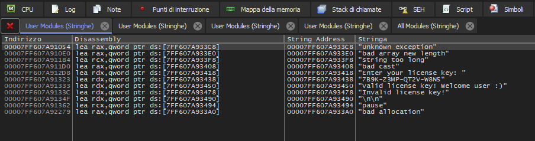
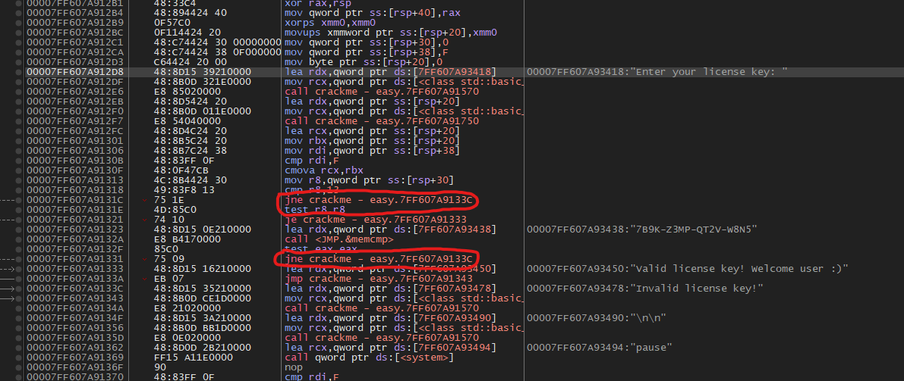
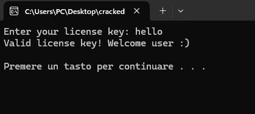
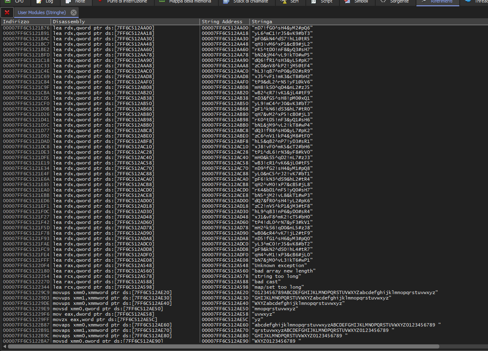

# Crackme in C++
> Use this repository to learn how software cracking and piracy work, and therefore learn how to protect yourself

## Features
- Anti debugging checks in separate threads, using Windows APIs: `IsDebuggerPresent`, `CheckRemoteDebuggerPresent`, `NtQueryInformationProcess`.
- Internal string obfuscation and runtime decoding functions with a random pattern that is generated at program startup each time (used to encrypt variables in memory).
- Decoding function for strings inserted into the executable during coding (you can encrypt other strings using the python script BuildString.py).
- Some random operations in a separate thread that does unnecessary things to create further confusion and noise.
- Passing data to global strings that are cleaned and reused multiple times.

## How to use
To compile the executables, open the .sln files with Visual Studio and build them. Compile in Release mode for better security
> You need to install the [libcurl](https://github.com/curl/curl) library to compile the hard version, as it is used to send the POST request to verify the key

Do not include clear words or strings in the executable. Use the Python script BuildString.py, enter the word you want to include in the executable and press enter. It will return the encrypted string, which you should then copy and paste into the code

To decode the string at runtime in the executable use the `unbuildString()` function. Avoid storing the returned value in a variable, for example:
```cpp
std::string text = unbuildString("wB1&cR5^vK3!jL8@tF2|hL9^qB4!nP1&yD6#sR3|");
cout << text;
```
Do it like this instead:
```cpp
cout << unbuildString("wB1&cR5^vK3!jL8@tF2|hL9^qB4!nP1&yD6#sR3|");
// The console will print the deobfuscated text without storing it in any variable first
```

## Easy version
Here in the debugger (i’m using [x64dbg](https://github.com/x64dbg/x64dbg)) we can see the disassembly of the easy version of the CrackMe

As you can see, all the string references are clear and readable, by clicking on what interests us, we can go directly to the critical function that handles the license verification without even having to study the program




We have easily found the two instructions we are interested in and that we need to patch, so that the program accepts any key we enter



### Original version
```asm
cmp r8, 12            ; Compare r8 to 12 (probably the length of the key)
jne 7FF607A9133C      ; If r8 is different from 12 it jumps to error

call memcmp           ; Compare the key you entered with the valid one (in the executable)
test eax, eax         ; Check if EAX = 0
jne 7FF607A9133C      ; If EAX is not equal to 0 it jumps to the error
```

### Patched version
```asm
; Change the two jne instructions to je

je 7FF607A9133C       ; If r8 equals 12 jump to error
je 7FF607A9133C       ; It jumps to the error if EAX = 0 (correct key)
```

By applying the patch, the executable will accept all keys, except for the real key, which was previously the only valid one




## Hard version
> P.S. Here i compiled the executable removing the anti debug checks so that it’s possible to view the disassembly in x64dbg otherwise the program would have terminated automatically

Now the string references are no longer clear. They are random sequences that don’t allow the reverse engineer to quickly identify as before which is the critical function to patch



Now it’s tough for the reverse engineer. They will have to reconstruct all the logic we applied, understanding how the executable obfuscates and deobfuscates strings, how it passes data through global variables, figuring out which functions are useless and only create confusion without doing anything truly useful and so on, until they intercept the critical `checkLicenseKey()` function, all from an ASM disassembly.

This ensures that anyone trying to crack your program, even with beginner or intermediate skills, will hardly succeed and will likely give up finding the process practically impossible to overcome

The goal of anti reverse engineering is exactly this, to discourage attempts to analyze the program making the process too long and complex for those without advanced knowledge

Completely stopping it is impossible, no one has ever succeeded. The same applies to cheating in video games, a phenomenon very similar to cracking. It’s not a matter of superior skills but of the very nature of how a PC works. The program runs on the user’s machine not in the cloud, so anyone executing it has access to everything, memory, data sent to the CPU, and registers...

This repository serves as an example to show how to implement security measures that make cracking more difficult and discouraging. However it is important to understand that everything is theoretically bypassable including what is shown here.

You can further improve my code to make it even more robust. For example:

- By implementing a checksum that verifies all files using SHA256 to detect any modifications or tampering
- By adding useless strings and cloned functions of the critical `checkLicenseKey` function, connected to each other in a way that prolongs the search and the “puzzle solving” time, making it harder to figure out which is the real function the program actually uses
- By integrating VMProtect which converts code blocks into proprietary bytecode executed on an internal virtual machine and further encrypting strings and program functions
- By adding additional anti debugger and anti-tamper protections and renaming functions and variables

VMProtect in particular makes it difficult to patch the executable, preventing the creation of distributable cracked copies
